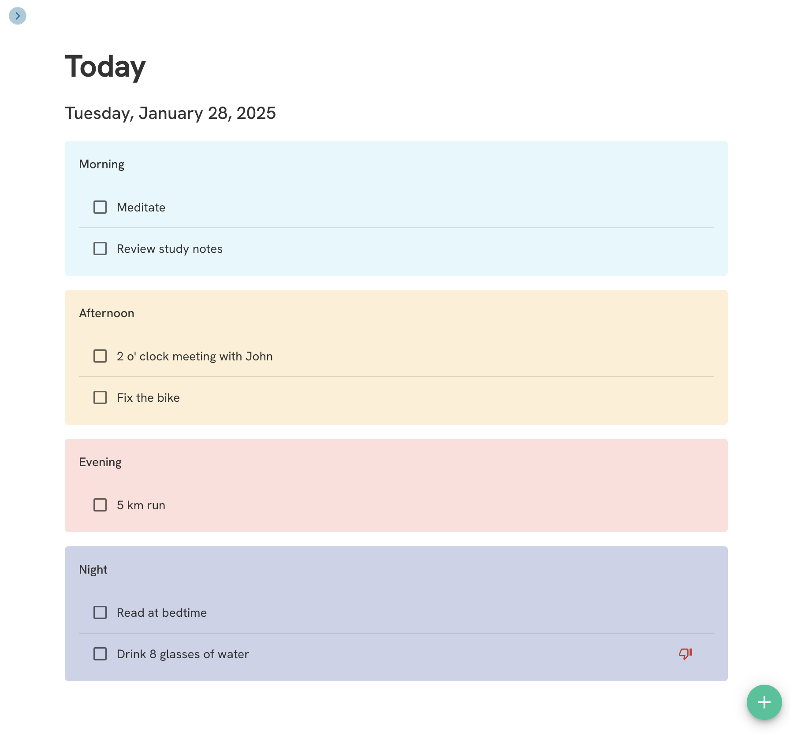
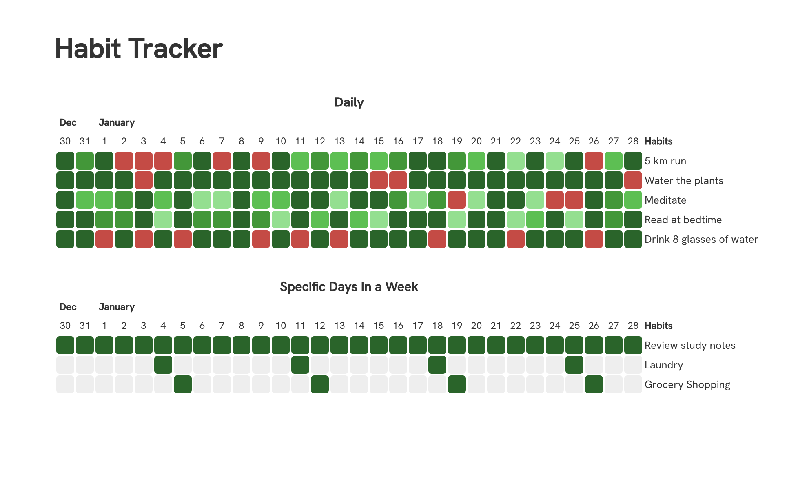

#  BlocksTracker

**BlocksTracker** is an open-source, offline-first task and habit tracker designed to help you build better routines without giving up your data. No logins. No distractions. Just blocks of time, tracked and owned by you.


---

## ✨ Features

- ✅ Unified task + habit tracking interface
- 📴 Works entirely offline — your data stays on your device
- 📊 See trends and behavior with minimal analytics
- 🧩 Built with modular tech: Electron, React, and SQLite
- 🛠️ Extensible and open-source under GPLv3

---

## 📸 Screenshots

<p align="center">
  
</p>

<p align="center">
  
</p>

---

## 🚀 Getting Started

### 1. Clone the Repository

```bash
git clone git@github.com:ArnobChowdhury/blocks.git
cd blocks
```

### 2. Set Up Environment Variables

This project uses environment variables for configuration. You'll need to create a `.env` file by copying the example file.

```bash
# Create a copy of the example file
cp .env.example .env
```

Now, open the newly created `.env` file and add the necessary values as indicated in the file. For example, you will need to add your `GOOGLE_CLIENT_ID` for Google Sign-In to work.

### 3. Install Dependencies and Run

```bash
npm i
npm start
```

To build for a platform(win/linux/mac), from that specific platform run

```bash
npm run package
```

## 🛠 Tech Stack

- **Desktop**: Electron + React
- **Mobile**: React Native
- **Database**: SQLite
- **Backend**: Go (for sync & cloud storage - optional)

---

## 🧪 Roadmap (Beta Phase)

- [ ] Sync engine with multi-device support (premium)
- [ ] Import/export via JSON
- [ ] Custom notifications/reminders
- [ ] Optional encrypted cloud backup (premium)

## 📄 License

BlocksTracker is licensed under the **GNU General Public License v3.0**.
See the [LICENSE](./License) file for more details.

---

## 🗣 About the Creator

Made with 💻 and ☕ by [@sami](https://github.com/ArnobChowdhury)
Let’s talk about clean code, indie hacking, and remote work.
